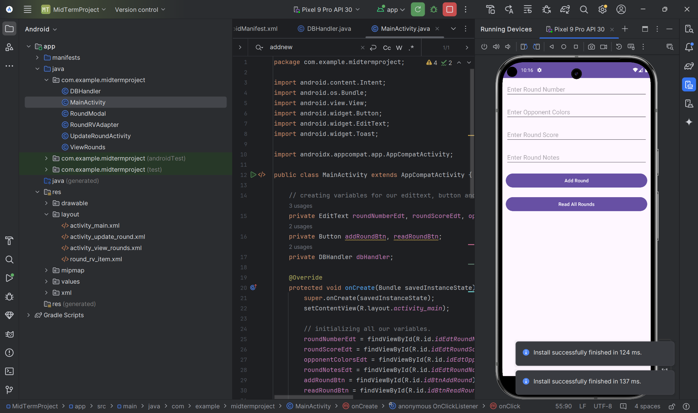

TCG Tournament Round Tracker

This is an Android application that allows users to track rounds during a Trading Card Game (TCG) tournament. The app lets users log details about each round, including the round number, score, opponent's colors, and additional notes.
Features

    Add and save rounds with key details:
        Round number
        Opponent's colors
        Round notes
        Round score
    View all saved rounds.
    Edit or delete existing rounds.
    Persistent data storage using SQLite.

Technologies Used

    Java: Main programming language for the app.
    SQLite: Local database for data persistence.
    Android Studio: IDE for building the application.
    XML: Used for designing the user interface.

Installation

    Clone the repository:

    git clone https://github.com/AJarete/TCG-Tournament-Round-Tracker.git

    Open the project in Android Studio.
    Build the project to download the necessary dependencies.
    Run the app on an emulator or an Android device.

Adding a New Round

    Fill in the details of the round (round number, score, opponent colors, notes).
    Click the Add Round button to save the round to the database.

Viewing All Rounds

    Click the View Rounds button.
    The app will display all saved rounds in the next activity.

Key Components

    MainActivity: Handles input for adding rounds and navigation to the view activity.
    ViewRounds: Displays all saved rounds in a list or table view.
    DBHandler: Manages SQLite database operations such as insert, read, update, and delete.

    
